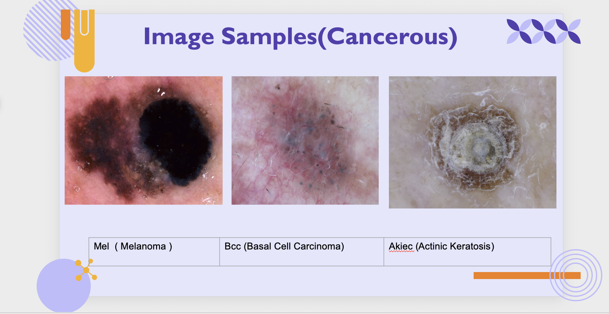
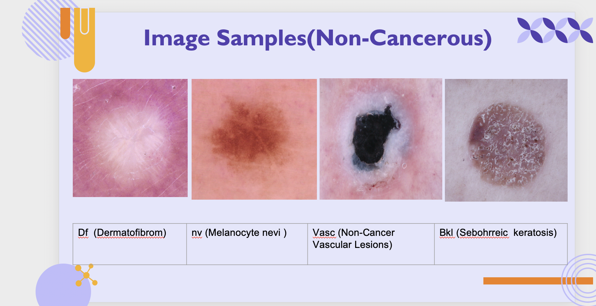
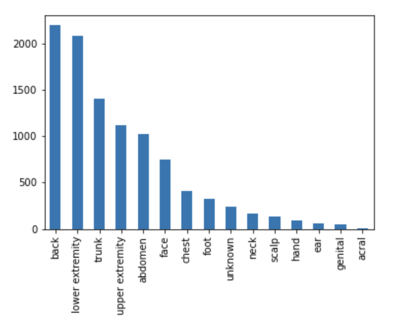

Skin Cancer Diagnosis using Deep Learning (Final Proposal)
==========================================================

## Introduction

In this project, we are going to develop a custom application that identifies skin cancer (Melanoma) lesions from dermoscopic images. The application will utilize the state-of-art deep learning technologies and libraries to accomplish this task with high accuracy. To this end, we are going to use special kind of neural networks (NNs) which are highly effective in discovering and classifying patterns in images. this special kind of NNs is called Convoluted Neural Networks (CNNs).

## Research Questions

- Can we (in early stage of the disease) be able to classify and/or predict the existence of melanoma and distinguish it from the rest of other non-cancerous skin lesions from dermoscopic images of patients?

## Data Source

- We downloaded public data set of skin cancer dermoscopic images from Kaggle Website.
- The data set was contributed to kaggle by The international Skin Imaging Collaboration Consortium (ISIC). The ISIC is an international consortium which aims to improve melanoma diagnosis, sponsored by the international society of Digital Imaging of The Skin (ISDIS). The ISIC Archive contains the largest publicly available collection of quality controlled dermoscopic images of skin lesions.

## Data Description

- Mainly, The data contains approximately 10,000 dermoscopic images of melanoma that has a size of ~ 3GB on disk.
- The data has metadata file associated with it, below is just the top 10 records.

|lesion_id  |image_id    |dx |dx_type|age |sex   |localization|
|-----------|------------|---|-------|----|------|------------|
|HAM_0000118|ISIC_0027419|bkl|histo  |80.0|male  |scalp       |
|HAM_0000118|ISIC_0025030|bkl|histo  |80.0|male  |scalp       |
|HAM_0002730|ISIC_0026769|bkl|histo  |80.0|male  |scalp       |
|HAM_0002730|ISIC_0025661|bkl|histo  |80.0|male  |scalp       |
|HAM_0001466|ISIC_0031633|bkl|histo  |75.0|male  |ear         |
|HAM_0001466|ISIC_0027850|bkl|histo  |75.0|male  |ear         |
|HAM_0002761|ISIC_0029176|bkl|histo  |60.0|male  |face        |
|HAM_0002761|ISIC_0029068|bkl|histo  |60.0|male  |face        |
|HAM_0005132|ISIC_0025837|bkl|histo  |70.0|female|back        |
|HAM_0005132|ISIC_0025209|bkl|histo  |70.0|female|back        |

image_id: is the name of the image file on disk

sex: the patient gender

localization: the location of the skin lesion in the patient's body

Types of Cancerous Lesions
==========================

- The following image depicts some included types of cancerous (malignant) skin lesions.

- The following image depicts some included types of non-cancerous (Benign) skin lesions.

- The following table illustrates all incuded types of skin lesions in the data set

|Skin Diseases                     |Pathology                    |
|----------------------------------|-----------------------------|
|nv (Melanocyte nevi )             |Non-Cancerous                |
|Bkl (Sebohrreic  keratosis)       |Non-Cancerous                |
|Df  (Dermatofibrom)               |Benign Tumors (Non Cancerous)|
|Vasc (Non-Cancer Vascular Lesions)|Non-Cancerous                |
|                                  |Pyogenic Granulomas          |
|Bcc (Basal Cell Carcinoma)        |Cancerous                    |
|Mel  ( Melanoma )                 |Cancerous (Malignant)        |
|Akiec (Actinic Keratosis)         |Cancerous                    |

Skin Lesions Localizations
==========================

Classification Approach
-----------------------

- We used binary classification (2 classes) to distinguish between Skin Cancer and Non-Cancer lesions.

- We also used another multi-class classification (7 classes) different skin lesions from each others including skin cancer lesions.

Methodology
-----------

1. Preprocessing includes Rescaling, Resizing, Zoom and Rotating
2. Image Augmentation includes Batch Normalization, Pool Size and filters
3. Convoluted Neural Network using different Convoluted CNN architectures to classify skin lesions
4. Transfer Learning using Different pretrained models with complex MLP

Results
=======

## Transfer Learning Models' Performances (7 classes)

|Pretrained                        |Accuracy Train               |Accuracy Validation|
|----------------------------------|-----------------------------|-------------------|
|ResNet152                         |0.663                        |0.693              |
| EfficientNet                     |0.66                         |0. 690             |
|VGG16                             |0.661                        |0. 691             |
|VGG19                             |0.661                        |0. 692             |
|DenseNet                          |0.661                        |0.693              |

## Transfer Learning Models' Performances (2 classes)

|Pretrained                        |Accuracy Train               |Accuracy Validation|
|----------------------------------|-----------------------------|-------------------|
|ResNet152                         |0.8014                       |0.833              |
| EfficientNet                     |0.8014                       |0.833              |
|VGG16                             |0.8                          |0.833              |
|VGG19                             |0.8                          |0.833              |
|DenseNet                          |0.8014                       |0.833              |

## Future Work

- This project could be extended further to diagnose skin cancer lesions at early stages to guide precision treatment as early as possible through feeding more high-resolution images and utilizing dimensionality reduction techniques in the deep learning pipeline.

## Tools

- Software Platform: Jupyter Notebook
- Programming Language: Python
- Libraries:
	- Sci-Kit Learn
	- TensorFlow
	- Keras
	- Numpy
	- Seaborn
	- Matplotlib